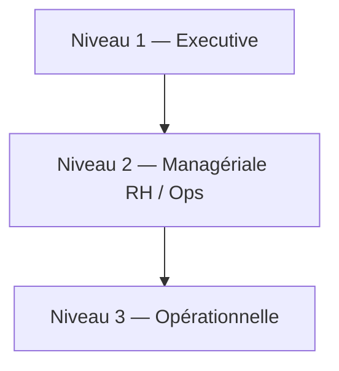

# Bloc 5 — Spécification dashboards (Metabase + Admin Angular)

Dashboard Metabase cible : **« Find-Me — Entrepôt décisionnel »**  
Connexion : `Find-Me | Entrepôt décisionnel (findme_dw)`  
Seed : `bi/metabase/seed_metabase.py` · Manifest : `find-me-front-2.1/src/assets/bi/bi-manifest.json`

---

## 5.1 Pyramide des 3 niveaux

### Niveau 1 — Executive (Direction / ADMIN)

**Objectif :** 30 secondes pour comprendre la santé de la plateforme.

| Zone | Carte SQL | Visualisation | Message data storytelling |
|------|-----------|---------------|---------------------------|
| Bandeau KPI | `05_kpi_executif` | Table / big numbers | « X candidatures pour Y missions » |
| Tendance recrutement | `12_candidatures_par_mois` | Courbe | Comparer dernier mois vs précédent |
| Conversion | `13_taux_conversion_candidatures` | Camembert | Insight : part acceptées |
| Effectifs | `01_utilisateurs_par_role` | Barres | Répartition écosystème |

**Filtres globaux Metabase :** `year_num`, `quarter_num` (via paramètres dashboard sur `dim_date`).

### Niveau 2 — Managériale (DRH / Chargé recrutement / Manager ESN)

| Zone | Cartes | Visualisation |
|------|--------|---------------|
| Pipeline missions | `06`, `07`, `09`, `15` | Barres + courbe |
| Pipeline candidatures | `08`, `12`, `14` | Barres + top 10 |
| Qualification | `19`, `20`, `23` | Camembert + barres framework |
| Compétences marché | `17` | Barres horizontales |
| Géographie | `03`, `10` | Barres |

**Comparaisons à afficher :**

- Mois N vs N-1 (filtre Metabase « Previous period »)
- vs objectif interne (ligne de référence 25 % conversion — annotation Metabase)

### Niveau 3 — Opérationnelle (analyste / admin terrain)

| Zone | Cartes | Usage |
|------|--------|-------|
| Détail statuts | `08`, `18` | Backlog ENCOURS |
| Notifications | `04` | Charge communication |
| Favoris | `11` | Intérêt par `user_type` |
| CV | `16`, `18` | Complétion profils |

**Exploration OLAP :**

| Action | Metabase | Exemple |
|--------|----------|---------|
| Slice | Filtre statut = ACCEPTER | Candidatures acceptées seules |
| Dice | IT + Q2 + Tunisie | Si dimensions enrichies |
| Drill-down | Clic mois → détail missions | `14_top_missions_candidatures` |
| Roll-up | Vue `v_bi_kpi_recrutement` | Par trimestre |

---

## 5.2 Layout dashboard Metabase (grille 3 × 6)

| Ligne | Col 1 | Col 2 | Col 3 |
|-------|-------|-------|-------|
| 1 | KPI exécutif | Utilisateurs rôle | Utilisateurs statut |
| 2 | Candidatures / mois | Missions / mois | Conversion |
| 3 | Candidatures statut | Top missions | Type contrat |
| 4 | Top villes | Favoris | Télétravail |
| 5 | CV / mois | Top compétences | Étapes CV |
| 6 | Quiz réussite | Quiz score | Codingame mois |
| 7 | Codingame score | Codingame framework | Notifications |

*(Aligné sur le seed : 23 cartes, `sizeX=6`, `sizeY=4`.)*

---

## 5.3 Page Admin Angular (`bi-dashboard`)

| Onglet manifest | Niveau | Cartes |
|-----------------|--------|--------|
| Vue d'ensemble | Executive | `executive_kpis` |
| Utilisateurs & engagement | Managériale | users_*, notifications_* |
| Missions & candidatures | Managériale | missions_*, applications_* |
| CV & compétences | Opérationnelle | cvs_*, cv_* |
| Quiz & Codingame | Opérationnelle | quiz_*, codingame_* |

**Principe :** pas d’iframe Metabase (CSP) → boutons « Ouvrir dans Metabase » + manifest dynamique.

---

## 5.4 Charte visuelle (PFE)

| Élément | Valeur |
|---------|--------|
| Couleur primaire | `#4f46e5` (aligné admin BI) |
| Vert / succès | `#22c55e` |
| Orange / attention | `#f59e0b` |
| Rouge / alerte | `#ef4444` |
| Police | Inter / système UI |

---

## 5.5 Alertes (Should — Metabase Pulse)

| KPI | Condition | Destinataire |
|-----|-----------|--------------|
| KPI-05 conversion | &lt; 10 % sur 30 j | ADMIN email |
| KPI-04 candidatures | 0 avec missions OPEN | Chargé recrutement |
| ETL | `etl_run_log.status = FAILED` | Ops |

---

## 5.6 Livrables Bloc 5

- Ce document `dashboards_spec.md`
- Dashboard Metabase (auto) + captures PDF pour rapport

## 5.7 Erreurs courantes

- Trop de graphiques sans **titre insight**.
- Mélanger niveaux executive et détail sur **un seul écran**.
- Oublier **filtre période** par défaut (12 derniers mois).
