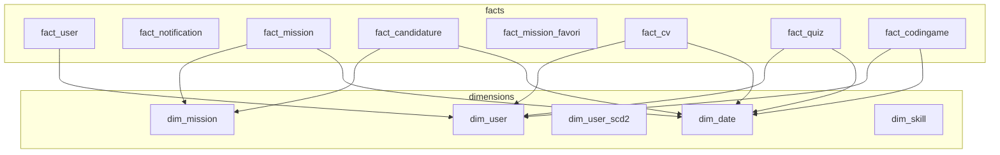

# Bloc 2 — Modèle dimensionnel `findme_dw` (schéma en étoile)

## 2.1 Diagramme logique



## 2.2 Granularité des faits

| Table de faits | Grain (1 ligne =) | Mesures | Dimensions |
|----------------|-------------------|---------|------------|
| `fact_user` | 1 utilisateur | `user_count` | `dim_user` |
| `fact_notification` | 1 notification | `notification_count`, `is_read` | `dim_date` |
| `fact_mission` | 1 mission | `mission_count` | `dim_date`, `dim_mission` |
| `fact_candidature` | 1 candidature | `candidature_count`, flags statut | `dim_date`, `dim_mission` |
| `fact_mission_favori` | 1 favori | `favori_count` | `dim_date`, `dim_mission` |
| `fact_cv` | 1 CV | `cv_count`, `steps_completed` | `dim_date`, `dim_user` |
| `fact_quiz` | 1 tentative quiz | `score`, `passed`, `attempt_count` | `dim_date`, `dim_user` |
| `fact_codingame` | 1 résultat évaluation | `score`, `total_score`, `session_count` | `dim_date`, `dim_user` |

## 2.3 Clés

| Type | Colonne | Exemple |
|------|---------|---------|
| Surrogate (entrepôt) | `user_key`, `mission_key` | 42 |
| Naturelle (OLTP) | `user_id`, `mission_id` | ID microservice |
| Temps | `date_key` | 20260520 → 20/05/2026 |

**Ligne inconnue temps :** `date_key = 19000101` quand date source absente.

## 2.4 SCD (Slowly Changing Dimensions)

| Dimension | Type | Usage Find-Me |
|-----------|------|---------------|
| `dim_user` | **SCD 1** | Image courante (rôle, statut, pays) — ETL actif |
| `dim_user_scd2` | **SCD 2** | Historique `valid_from` / `valid_to` — structure prête, ETL phase 2 |
| `dim_mission` | SCD 1 | Dernière description mission |
| `dim_date` | Statique | Calendrier 2020–2035 |

### Exemple SCD 2 (RH)

Un candidat passe de `CANDIDAT` à `FREELANCER` :

| user_scd_key | user_id | role_name | valid_from | valid_to | is_current |
|--------------|---------|-----------|------------|----------|------------|
| 1 | 100 | CANDIDAT | 2025-01-01 | 2026-03-01 | 0 |
| 2 | 100 | FREELANCER | 2026-03-02 | NULL | 1 |

Analyse « combien de candidats en janvier 2025 » → jointure sur version **courante à cette date**, pas sur `dim_user` seul.

## 2.5 Vues analytiques

| Vue | Rôle |
|-----|------|
| `v_bi_candidature` | Drill candidatures (mission + temps + statut) |
| `v_bi_mission` | Pipeline offres |
| `v_bi_kpi_recrutement` | Taux acceptation mensuel pré-agrégé |

## 2.6 Mapping OLTP → entrepôt

| OLTP | Table entrepôt |
|------|----------------|
| `user_bd.users` + `roles` | `dim_user`, `fact_user` |
| `user_bd.notification` | `fact_notification` |
| `mission_bd.mission` + `descrip_mission` + `ville`/`pays` | `dim_mission`, `fact_mission` |
| `mission_bd.candidature` | `fact_candidature` |
| `mission_bd.mission_favoris` | `fact_mission_favori` |
| `cv_bd.cv` + `competence` | `fact_cv`, `dim_skill` |
| `quiz_bd.user_quiz_results` | `fact_quiz` |
| `codingame_bd.evaluation_session` + `evaluation_result` | `fact_codingame` |

## 2.7 Livrables Bloc 2

- `bi/dw/schema.sql` (DDL source de vérité)
- Ce document `schema.md`

## 2.8 Erreurs courantes

- Stocker un **taux** dans une table de faits (non additif) → calculer en SQL / Metabase.
- Oublier la clé **19000101** → jointures excluent les lignes sans date.
- Dupliquer `mission_name` dans `fact_candidature` au lieu de `dim_mission` (redondance).

## 2.9 Application du schéma

```bash
# Via ETL (recommandé)
docker compose run --rm bi-etl

# Ou manuellement
Get-Content bi/dw/schema.sql | docker exec -i findme-mysql mysql -uroot -proot
```
