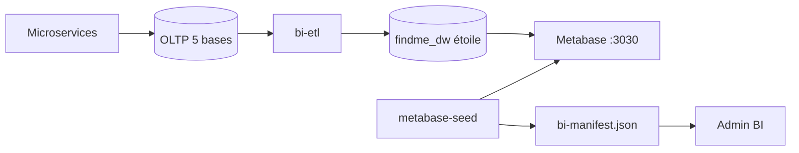

# Find-Me BI — Metabase (production & PFE)

Stack BI : **ETL** → entrepôt **`findme_dw` (schéma en étoile)** → **Metabase** → `bi-manifest.json` → admin Angular.

## Architecture



| Composant | Rôle |
|-----------|------|
| `bi-etl` | ETL Python → dimensions + faits |
| `findme_dw` | Entrepôt décisionnel (étoile) |
| `findme_bi` | SELECT sur `findme_dw` (et OLTP si legacy) |
| `seed_metabase.py` | Dashboard + 23 requêtes `sql/dw/` |
| `bi-manifest.json` | Lien admin ↔ cartes Metabase |

## Démarrage (Docker complet)

```bash
docker compose up -d --build
```

Attendre **`findme-bi-etl`** puis **`findme-metabase-seed`** (logs : `ETL terminé`, `Manifest BI écrit`). Puis :

- Metabase : http://localhost:3030  
- Admin app : http://localhost:4200 → connexion **ADMIN** → **Tableaux de bord BI**

### Identifiants par défaut

| | Valeur |
|---|--------|
| Email Metabase | `bi-admin@findme.local` |
| Mot de passe | `FindMe_BI_Auto_2026!xQ7vM2` |
| MySQL BI | `findme_bi` / `findme_bi_readonly` |

## Catalogue des 23 indicateurs

### Utilisateurs (`user_bd`)
| Fichier | Indicateur |
|---------|------------|
| `01_utilisateurs_par_role.sql` | Répartition par rôle (CANDIDAT, ESN, ADMIN…) |
| `02_utilisateurs_par_statut.sql` | Comptes PENDING / ACTIVE / INACTIVE |
| `03_utilisateurs_par_pays.sql` | Géographie des profils |
| `04_notifications_par_mois.sql` | Volume notifications + lues / non lues |
| `05_kpi_executif.sql` | KPI synthèse (users, candidats, docs…) |

### Missions (`mission_bd`)
| `01` | Missions par statut |
| `02` | Missions créées par mois |
| `03` | Candidatures par statut |
| `04` | Type de contrat |
| `05` | Top villes |
| `06` | Favoris par type utilisateur |
| `07` | Candidatures par mois |
| `08` | Taux de conversion candidatures |
| `09` | Top 10 missions sollicitées |
| `10` | Télétravail vs sur site |

### CV (`cv_bd`)
| `01` | CV créés par mois |
| `02` | Top compétences (langages, frameworks, DB, outils) |
| `03` | Étapes formulaire CV complétées |

### Évaluations
| Quiz `01` | Réussite / échec |
| Quiz `02` | Score moyen & taux de réussite |
| Codingame `01` | Sessions par mois |
| Codingame `02` | Score moyen global |
| Codingame `03` | Score par framework |

## Alignement schéma application

Les requêtes utilisent les tables Hibernate réelles (`users`, `roles`, `mission`, `candidature`, `descrip_mission`, `cv`, `competence`, `user_quiz_results`, `evaluation_session`, etc.). Voir le mapping détaillé en fin de ce fichier.

## Reset / mise à jour BI

**Nouveau dashboard complet** (après changement majeur des SQL) :

```bash
docker compose down
docker volume rm findmebyeyarhit_metabase_data
docker compose up -d --build metabase metabase-seed
```

**Manifest seulement** (dashboard déjà existant) : relancer `metabase-seed` — le script régénère `bi-manifest.json` sans recréer les cartes.

```bash
docker compose up -d --build metabase-seed
```

Puis rebuild frontend si besoin : `docker compose build frontend`

## Export PDF (démo PFE)

1. Ouvrir le dashboard **Find-Me — BI complet** dans Metabase  
2. Menu ⋮ → **Exporter** → **PDF**  
3. Joindre les captures de la page admin Angular (onglets par domaine)

## Dépannage

| Problème | Action |
|----------|--------|
| Manifest vide dans l’admin | Vérifier logs `findme-metabase-seed`, volume `./find-me-front-2.1/src/assets/bi` |
| `findme_bi` absent | Exécuter `docker/mysql-init/02-findme-bi-readonly.sql` ou reset volume `mysql_data` |
| Carte SQL en erreur | Vérifier nom de colonne (snake_case JPA) dans Metabase → question → éditer |
| Port 3030 occupé | Modifier `ports` du service `metabase` |

## Mapping entités → tables

### user-service (`user_bd`)
- `User` → `users` · `Role` → `roles` · `Notification` → `notification` · `Document` → `document`

### cv-service (`cv_bd`)
- `Cv` → `cv` · `Competence` → `competence` · `cv_competence`, `cv_completed_steps`

### mission-service (`mission_bd`)
- `Mission` → `mission` · `Candidature` → `candidature` · `Descrip_mission` → `descrip_mission` · `MissionFavori` → `mission_favoris` · `Ville` → `ville`

### quiz-service (`quiz_bd`)
- `UserQuizResult` → `user_quiz_results`

### codingame-service (`codingame_bd`)
- `EvaluationSession` → `evaluation_session` · `EvaluationResult` → `evaluation_result` · `Framework` → `framework`

## Fichiers supprimés (legacy)

- `seed.js` (Node) — remplacé par `seed_metabase.py`  
- `sql/01_users.sql` … `05_codingame.sql` — doublons non utilisés par le seed
