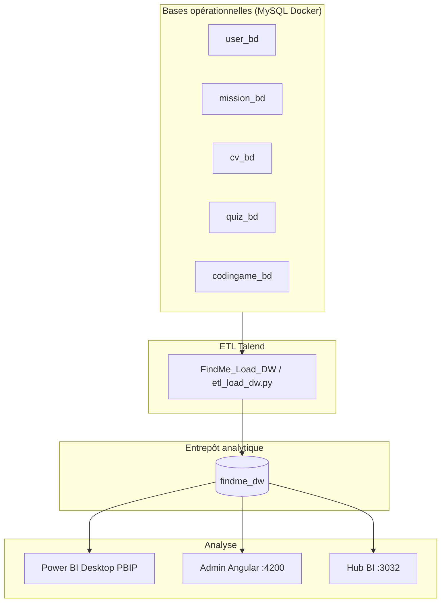
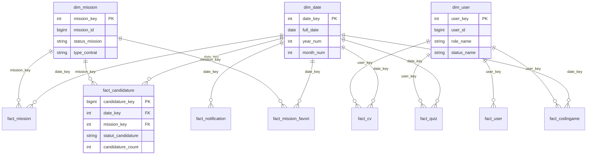

# Guide complet — Business Intelligence Find-Me (Talend + Power BI)

Document de référence **unique** pour le PFE : architecture, entrepôt en étoile, mesures DAX, 4 dashboards Power BI, KPI SQL, filtres, bases de données et chaîne technique.

**Projet** : [findMeByEyarhit](https://github.com/eyarhit/findMeByEyarhit)  
**Projet Power BI** : `bi/powerbi/FindMe-Dashboard/FindMe-Dashboard.pbip`  
**Complément colonne par colonne** : [POWERBI_TABLES_ET_MESURES.md](./POWERBI_TABLES_ET_MESURES.md)

---

## Table des matières

1. [Vue d’ensemble](#1-vue-densemble)
2. [Bases de données](#2-bases-de-données)
3. [Schéma en étoile (findme_dw)](#3-schéma-en-étoile-findme_dw)
4. [Relations et modèle sémantique Power BI](#4-relations-et-modèle-sémantique-power-bi)
5. [Alimentation ETL (Talend)](#5-alimentation-etl-talend)
6. [Table MesuresBI — toutes les mesures DAX](#6-table-mesuresbi--toutes-les-mesures-dax)
7. [Les 4 pages dashboard (détail)](#7-les-4-pages-dashboard-détail)
8. [Catalogue KPI SQL (24 indicateurs)](#8-catalogue-kpi-sql-24-indicateurs)
9. [Filtres, segments et interaction](#9-filtres-segments-et-interaction)
10. [Application admin & Hub BI](#10-application-admin--hub-bi)
11. [Commandes et fichiers du dépôt](#11-commandes-et-fichiers-du-dépôt)
12. [Techniques OLAP & bonnes pratiques](#12-techniques-olap--bonnes-pratiques)
13. [Glossaire](#13-glossaire)

---

## 1. Vue d’ensemble

### 1.1 Objectif métier

Find-Me est une plateforme de recrutement (missions, candidatures, CV, quiz, CodinGame). La couche BI répond à trois questions :

| Niveau | Public | Question type |
|--------|--------|----------------|
| **Executive** | Direction | Combien de candidatures ? Quel taux d’acceptation ? Évolution mensuelle ? |
| **Managerial** | RH / managers | Répartition par statut, contrat, ville ? Détail par mission ? |
| **Operationnel** | Exploitation | Utilisateurs, notifications, CV, compétences ? |
| **Technique** | Équipe / jury | Quiz, CodinGame, fraîcheur ETL ? |

### 1.2 Chaîne technique (bout en bout)



### 1.3 Les trois couches de données

| Couche | Nom | Rôle | Technologie |
|--------|-----|------|-------------|
| **OLTP** | Bases métier | Transactions temps réel (inscription, candidature, CV) | MySQL `user_bd`, `mission_bd`, … |
| **DW** | `findme_dw` | Analyse historisée, grain stable, KPI reproductibles | MySQL schéma étoile |
| **OLAP** | Rapports | Visualisation, filtres croisés, mesures DAX | Power BI + app admin |

---

## 2. Bases de données

### 2.1 Bases opérationnelles (sources ETL)

L’ETL lit les bases **Find-Me** exposées par Docker (service `mysql`, port **3306**).

| Base | Contenu principal | Tables typiques |
|------|-------------------|-----------------|
| `user_bd` | Comptes, rôles, statuts | `users`, profils |
| `mission_bd` | Offres / missions | `mission`, statuts, contrats |
| `cv_bd` | CV, compétences | CV, étapes de saisie |
| `quiz_bd` | Évaluations quiz | Tentatives, scores |
| `codingame_bd` | Tests techniques | Sessions, frameworks |

Ces bases sont **normalisées** (3FN) : adaptées à l’application, pas aux graphiques agrégés.

### 2.2 Entrepôt décisionnel `findme_dw`

| Propriété | Valeur |
|-----------|--------|
| **SGBD** | MySQL 8 (conteneur `findme-mysql`) |
| **Schéma** | `findme_dw` |
| **Modèle** | Étoile (Kimball) |
| **DDL source** | `bi/dw/schema.sql` |
| **Compte lecture BI** | `findme_bi` / `findme_bi_readonly` |
| **Compte ETL** | `root` (Docker interne) |

**Connexion Power BI Desktop**

```
Serveur : localhost
Port    : 3306
Base    : findme_dw
Utilisateur : findme_bi
Mot de passe : findme_bi_readonly  (voir docker/mysql-init/02-findme-bi-readonly.sql)
```

### 2.3 Pourquoi un entrepôt séparé ?

- **Performance** : agrégations pré-calculées ou grains simples (`SUM(user_count)`).
- **Historique** : `dim_user_scd2` pour suivre les changements de rôle/statut.
- **Cohérence** : une seule vérité pour Power BI, Metabase (legacy), Hub BI et admin Angular.
- **Sécurité** : compte `findme_bi` en lecture seule sur `findme_dw` uniquement.

---

## 3. Schéma en étoile (findme_dw)

### 3.1 Principes Kimball

| Concept | Définition Find-Me |
|---------|-------------------|
| **Grain** | Plus petite unité d’analyse d’une table de faits (ex. 1 ligne = 1 candidature). |
| **Dimension** | Contexte descriptif : qui, quoi, où, quand (texte, catégories). |
| **Fait** | Mesures **additives** (`*_count`, flags 0/1) qu’on somme. |
| **Clé surrogate** | `user_key`, `mission_key` : entiers internes au DW, stables pour les jointures. |
| **Clé naturelle** | `user_id`, `mission_id` : ID métier des bases OLTP. |

### 3.2 Diagramme relationnel (étoile)



### 3.3 Dimensions — rôle et colonnes clés

#### `dim_date` (temps)

- **Grain** : 1 jour calendaire.
- **Clé** : `date_key` = `YYYYMMDD` (ex. `20260520`) — **unique**, utilisée dans toutes les relations vers les faits.
- **Colonnes filtres** : `year_num`, `month_num`, `quarter_num`, `month_name`, `is_weekend`.
- **Attention** : `year_num` n’est **pas unique** (365 jours par an) → **ne jamais** créer de relation Power BI sur `year_num` seul.

#### `dim_user` (utilisateur — SCD type 1)

- Dernière image connue : rôle, statut, pays, sexe.
- Jointure : `fact_user.user_key`, `fact_cv.user_key`, etc.

#### `dim_user_scd2` (historique — SCD type 2)

- Plusieurs lignes par `user_id` avec `valid_from`, `valid_to`, `is_current`.
- Usage : analyse des changements de profil dans le temps (PFE avancé).

#### `dim_mission` (offre)

- Statut (`OPEN`, `CLOSED`, …), type de contrat, télétravail, ville, pays, libellé mission.

#### `dim_skill` (compétences agrégées depuis CV)

- `skill_label`, `skill_category`, `usage_count` (déjà agrégé au niveau compétence).

### 3.4 Tables de faits — grain et mesures

| Table | Grain (1 ligne =) | Mesure principale | Colonnes filtres |
|-------|-------------------|-------------------|------------------|
| `fact_user` | 1 utilisateur actif | `user_count` (=1) | — |
| `fact_notification` | 1 notification | `notification_count` | `is_read` |
| `fact_mission` | 1 mission créée | `mission_count` | `date_key` → temps |
| `fact_candidature` | 1 candidature | `candidature_count` | `statut_*`, flags accept/refus |
| `fact_mission_favori` | 1 favori | `favori_count` | `user_type` |
| `fact_cv` | 1 CV | `cv_count`, `steps_completed` | `date_key` |
| `fact_quiz` | 1 tentative quiz | `attempt_count`, `score` | `passed` |
| `fact_codingame` | 1 session / framework | `session_count`, `score` | `framework_name` |

**Règle d’or** : pour compter, utiliser `SUM(*_count)` ou `SUM` des flags 0/1 — pas `COUNTROWS` sur une dimension seule (sauf cas précis).

### 3.5 Vues métier `v_bi_*` (couche présentation SQL)

Les vues **pré-joint** dimensions + faits pour simplifier Power BI et les KPI SQL.

| Vue | Grain | Colonnes utiles | Page PBI |
|-----|-------|-----------------|----------|
| `v_bi_kpi_recrutement` | 1 ligne / (année, mois) | `candidatures`, `acceptees`, `refusees`, `taux_acceptation_pct` | 01 Executive |
| `v_bi_candidature` | 1 candidature enrichie | mission, statut, ville, dates | 02 Managerial |
| `v_bi_mission` | 1 mission enrichie | contrat, remote, ville, `mission_count` | 02 Managerial |

Définition SQL : fin de `bi/dw/schema.sql`.

### 3.6 Gouvernance — `etl_run_log`

| Colonne | Description |
|---------|-------------|
| `run_id` | Identifiant exécution |
| `started_at` / `finished_at` | Horodatage |
| `status` | `RUNNING`, `OK`, `SUCCESS`, `ERROR` |
| `rows_loaded` | Volume chargé |
| `error_message` | Détail si échec |

**Page** : 04 - Technique (tableau + carte **Runs ETL OK**).

---

## 4. Relations et modèle sémantique Power BI

### 4.1 Projet PBIP

| Élément | Chemin |
|---------|--------|
| Projet | `FindMe-Dashboard.pbip` |
| Modèle sémantique | `FindMe-Dashboard.SemanticModel/` |
| Rapport (4 pages) | `FindMe-Dashboard.Report/` |
| Génération | `scripts/generate-powerbi-pbip.ps1` + `scripts/generate-powerbi-multi-dashboard.ps1` |

### 4.2 Relations actives (générées)

| De (fait) | Vers (dimension) | Colonne | Cardinalité |
|-----------|------------------|---------|-------------|
| `fact_*` | `dim_date` | `date_key` | * → 1 |
| `fact_candidature` | `dim_mission` | `mission_key` | * → 1 |
| `fact_user` | `dim_user` | `user_key` | 1 → 1 |

Les vues `v_bi_*` **n’ont pas toujours** de relation vers `dim_date` dans le modèle : elles embarquent déjà `year_num`, `month_num` pour les segments.

### 4.3 Table calculée `MesuresBI`

- Table **vide** (1 ligne factice) qui ne sert qu’à **héberger les mesures DAX**.
- Avantage : toutes les mesures au même endroit dans le volet **Données** ; réutilisables sur les 4 pages.
- Fichier TMDL : `definition/tables/MesuresBI.tmdl`.

### 4.4 Pièges fréquents

| Erreur | Conséquence | Solution |
|--------|-------------|----------|
| Relation sur `dim_date[year_num]` | Modèle invalide / filtres incohérents | Segment sur `v_bi_*[year_num]` |
| Sommer `year_num` ou `month_num` | KPI absurdes | Utiliser `SUM` sur mesures de faits |
| Oublier **Actualiser** après ETL | Graphiques vides | Bouton Actualiser ou `GIT_PULL_BI.cmd` |
| Filtrer `year_num = 1900` (données démo) | Page 04 vide | `FIX_PAGE04_TECHNIQUE.cmd` + ETL seed |

---

## 5. Alimentation ETL (Talend)

### 5.1 Job et runtime

| Élément | Valeur |
|---------|--------|
| Job Talend (studio) | `bi/talend/studio/FindMe_Load_DW` |
| Runtime Docker | `bi/talend/docker/etl_load_dw.py` |
| Service Compose | `talend-etl` |
| Cible | Création / remplissage `findme_dw` |

### 5.2 Phases ETL (logique)

1. **Extraction** : lecture des 5 bases OLTP (utilisateurs, missions, CV, quiz, CodinGame).
2. **Staging** : nettoyage, valeurs par défaut (`INCONNU`, pays non renseigné).
3. **Chargement dimensions** : `dim_date` (calendrier), `dim_user`, `dim_mission`, `dim_skill`.
4. **Chargement faits** : compteurs à grain fixe (`*_count = 1` par événement).
5. **Journal** : insertion `etl_run_log` (`SUCCESS` / `ERROR`).
6. **Option seed** : données démo quiz/CodinGame si tables vides (page Technique).

### 5.3 Commandes

```cmd
docker compose up -d mysql
docker compose run --rm talend-etl
```

Ou chaîne complète : `scripts\bi-start.cmd`, `DOCKER_TEST_AMI.cmd`.

### 5.4 Quand actualiser ?

- Après création de missions / candidatures / CV dans l’app.
- Avant une démo Power BI ou jury.
- Depuis l’admin : **Synchroniser** (appelle Hub `POST /api/etl/run`).

---

## 6. Table MesuresBI — toutes les mesures DAX

Toutes les mesures ci-dessous sont définies dans **`MesuresBI`**. En Power BI : glisser la **mesure** (pas la colonne brute) dans les visuels **Carte**, **Graphique**, etc.

### 6.1 Mesures Executive (recrutement agrégé)

| Mesure | Formule DAX | Tables sources | Interprétation |
|--------|-------------|----------------|----------------|
| **KPI Candidatures** | `SUM(v_bi_kpi_recrutement[candidatures])` | Vue mensuelle | Total candidatures (période filtrée) |
| **KPI Acceptees** | `SUM(v_bi_kpi_recrutement[acceptees])` | Vue mensuelle | Candidatures acceptées |
| **KPI Refusees** | `SUM(v_bi_kpi_recrutement[refusees])` | Vue mensuelle | Candidatures refusées |
| **KPI Taux %** | `DIVIDE([KPI Acceptees], [KPI Candidatures], 0) * 100` | Calculée | Taux d’acceptation global |
| **Missions (vue)** | `SUM(v_bi_mission[mission_count])` | Vue missions | Nombre de missions |
| **Missions ouvertes** | `CALCULATE([Missions (vue)], v_bi_mission[status_mission] = "OPEN")` | Filtre statut | Missions encore ouvertes |
| **Missions remote** | `CALCULATE([Missions (vue)], v_bi_mission[is_remote] = 1)` | Filtre booléen | Missions en télétravail |

### 6.2 Mesures Managerial (détail candidatures)

| Mesure | Formule DAX | Interprétation |
|--------|-------------|----------------|
| **Candidatures (vue)** | `SUM(v_bi_candidature[candidature_count])` | Volume candidatures (grain détail) |
| **Acceptees (vue)** | `SUM(v_bi_candidature[is_accepted])` | Acceptées (flag) |
| **Refusees (vue)** | `SUM(v_bi_candidature[is_refused])` | Refusées |
| **En cours (vue)** | `SUM(v_bi_candidature[is_en_cours])` | En cours de traitement |
| **Taux % (vue)** | `DIVIDE([Acceptees (vue)], [Candidatures (vue)], 0) * 100` | Taux sur le détail |

### 6.3 Mesures Operationnel (activité plateforme)

| Mesure | Formule DAX | Interprétation |
|--------|-------------|----------------|
| **Total utilisateurs** | `SUM(fact_user[user_count])` | Utilisateurs actifs dans le DW |
| **Total notifications** | `SUM(fact_notification[notification_count])` | Notifications émises |
| **Notifications lues** | `CALCULATE([Total notifications], fact_notification[is_read] = 1)` | Sous-ensemble lues |
| **Taux lecture %** | `DIVIDE([Notifications lues], [Total notifications], 0) * 100` | Taux de lecture |
| **Total CV** | `SUM(fact_cv[cv_count])` | CV enregistrés |
| **Etapes moyennes** | `AVERAGE(fact_cv[steps_completed])` | Complétion moyenne du formulaire CV |
| **Total usages** | `SUM(dim_skill[usage_count])` | Occurrences compétences (CV) |
| **Total favoris** | `SUM(fact_mission_favori[favori_count])` | Missions mises en favori |

### 6.4 Mesures Technique (quiz, CodinGame, ETL)

| Mesure | Formule DAX | Interprétation |
|--------|-------------|----------------|
| **Tentatives quiz** | `COALESCE(SUM(fact_quiz[attempt_count]), 0)` | Nb tentatives quiz |
| **Score moyen quiz** | `COALESCE(AVERAGEX(fact_quiz, 0 + fact_quiz[score]), 0)` | Score moyen (types numériques forcés) |
| **Taux reussite quiz %** | Ratio tentatives `passed=1` / total | % réussite quiz |
| **Sessions codingame** | `COALESCE(SUM(fact_codingame[session_count]), 0)` | Sessions CDG |
| **Score moyen CDG** | `COALESCE(AVERAGEX(fact_codingame, 0 + fact_codingame[score]), 0)` | Score moyen CDG |
| **Score CDG %** | Ratio score / total_score | Performance relative |
| **Runs ETL OK** | `COUNTROWS` filtré `status IN {"OK","SUCCESS"}` | Nb exécutions ETL réussies |
| **Dernier refresh OK** | `MAX(finished_at)` si statut OK | Date du dernier ETL réussi |

### 6.5 Comment une mesure « fonctionne » dans Power BI

1. **Contexte de filtre** : chaque visuel + segment restreint les tables (ex. année 2026).
2. **Évaluation DAX** : la mesure recalcule `SUM` / `DIVIDE` dans ce contexte.
3. **Propagation** : les relations actives `date_key` / `mission_key` filtrent les faits liés.
4. **Vues `v_bi_*`** : filtres sur `year_num` appliqués directement sur la vue, sans passer par `dim_date`.

Exemple : segment **Année = 2026** sur `v_bi_kpi_recrutement[year_num]` → seules les lignes 2026 contribuent à `[KPI Candidatures]`.

---

## 7. Les 4 pages dashboard (détail)

Chaque page correspond à un onglet du rapport et à une route admin : `/utilisateur/bi/{niveau}`.

| Page | ID rapport | Route admin | Public |
|------|------------|-------------|--------|
| 01 - Executive | `page_exec_findme01` | `/bi/executive` | Direction |
| 02 - Managerial | `page_mgr_findme02` | `/bi/managerial` | RH |
| 03 - Operationnel | `page_ops_findme03` | `/bi/operational` | Exploitation |
| 04 - Technique | `page_tech_findme04` | `/bi/technique` | IT / jury |

### 7.1 Page 01 — Executive

**Objectif** : vision synthétique recrutement (volume, acceptation, tendance).

#### Cartes KPI (mesures MesuresBI)

| Carte | Mesure |
|-------|--------|
| Candidatures | KPI Candidatures |
| Acceptées | KPI Acceptees |
| Taux | KPI Taux % |
| Missions | Missions (vue) |
| Ouvertes | Missions ouvertes |

#### Graphiques

| Visuel | Type | Axe / Valeurs | Table |
|--------|------|---------------|-------|
| Évolution candidatures | Courbe | X : `month_num`, Y : KPI Candidatures | `v_bi_kpi_recrutement` |
| Acceptées vs refusées | Colonnes groupées | X : `month_num`, Y : `acceptees`, `refusees` | `v_bi_kpi_recrutement` |
| Taux mensuel | Courbe | X : `month_num`, Y : `taux_acceptation_pct` (moyenne) | `v_bi_kpi_recrutement` |
| Top missions | Barres | Y : `mission_name`, X : `candidature_count` | `v_bi_candidature` |

#### Segments (filtres)

| Segment | Champ | Effet |
|---------|-------|-------|
| Année | `v_bi_kpi_recrutement[year_num]` | Restreint tous les KPI mensuels |
| Type contrat | `v_bi_mission[type_contrat]` | Filtre missions liées |
| Date | `dim_date[full_date]` | Filtre calendaire (via relations faits) |

---

### 7.2 Page 02 — Managerial

**Objectif** : pilotage RH opérationnel (statuts, géographie, contrats, tableau détail).

#### Cartes KPI

| Carte | Mesure |
|-------|--------|
| Candidatures | Candidatures (vue) |
| Acceptées | Acceptees (vue) |
| Refusées | Refusees (vue) |
| En cours | En cours (vue) |
| Missions | Missions (vue) |

#### Graphiques

| Visuel | Type | Champs | Mesure |
|--------|------|--------|--------|
| Répartition statuts | Anneau | `statut_candidature` | Candidatures (vue) |
| Missions par contrat | Colonnes | `type_contrat` | Missions (vue) |
| Candidatures par mois | Courbe | `month_name` | Candidatures (vue) |
| Top villes | Barres | `ville` | Missions (vue) |
| Détail missions | **Tableau** | mission_name, reference_code, type_contrat, status_mission, ville, candidature_count | — |
| Villes empilé | Colonnes | `ville` + is_accepted / is_refused | Sommes |

#### Segments

| Segment | Champ |
|---------|-------|
| Année | `v_bi_candidature[year_num]` |
| Ville | `v_bi_mission[ville]` |
| Contrat | `v_bi_mission[type_contrat]` |
| Statut candidature | `v_bi_candidature[statut_candidature]` |
| Télétravail | `v_bi_mission[is_remote]` |

---

### 7.3 Page 03 — Operationnel

**Objectif** : activité utilisateurs, notifications, CV, compétences.

#### Cartes KPI

| Carte | Mesure |
|-------|--------|
| Utilisateurs | Total utilisateurs |
| Notifications | Total notifications |
| Lues | Notifications lues |
| Taux lecture | Taux lecture % |
| CV | Total CV |
| Étapes CV | Etapes moyennes |
| Favoris | Total favoris |

#### Graphiques

| Visuel | Type | Champs |
|--------|------|--------|
| Top compétences | Barres | `dim_skill[skill_label]` → Total usages |
| Rôles utilisateurs | Anneau | `dim_user[role_name]` → Total utilisateurs |
| Activité CV / notifs | Courbe | `dim_date[full_date]` → cv_count, notification_count |
| Étapes CV | Colonnes | `steps_completed` → cv_count |
| Catégories compétences | Anneau | `skill_category` → Total usages |
| Notifications | Courbe | dates → Total notifications, Notifications lues |

#### Segments

| Segment | Champ |
|---------|-------|
| Période | `dim_date[full_date]` |
| Rôle | `dim_user[role_name]` |
| Pays | `dim_user[country]` |
| Catégorie skill | `dim_skill[skill_category]` |

---

### 7.4 Page 04 — Technique

**Objectif** : qualité données, évaluations techniques, traçabilité ETL.

#### Cartes KPI

| Carte | Mesure |
|-------|--------|
| Tentatives quiz | Tentatives quiz |
| Score moyen quiz | Score moyen quiz |
| Taux réussite | Taux reussite quiz % |
| Sessions CDG | Sessions codingame |
| Score CDG | Score moyen CDG |
| ETL OK | Runs ETL OK |

#### Graphiques

| Visuel | Type | Champs |
|--------|------|--------|
| Score par framework | Barres | `fact_codingame[framework_name]` → Score moyen CDG |
| Score quiz dans le temps | Courbe | `dim_date[full_date]` → Score moyen quiz |
| Réussite quiz | Anneau | `fact_quiz[passed]` → Tentatives quiz |
| Quiz par utilisateur | Colonnes | `user_key` → attempt_count |
| **Journal ETL** | **Tableau** | started_at, finished_at, status, rows_loaded, error_message |
| Sessions CDG / mois | Courbe | `month_name` → Sessions codingame |

#### Segments

| Segment | Champ |
|---------|-------|
| Statut ETL | `etl_run_log[status]` |

**Note** : ne pas utiliser un segment `year_num = 1900` sur cette page (données de démo sans dates réalistes).

---

## 8. Catalogue KPI SQL (24 indicateurs)

Les requêtes dans `bi/kpis/sql/` alimentent l’**admin Angular** (API Hub `/api/kpis/page/{niveau}`) et documentent la logique métier. Elles lisent les **mêmes tables** que Power BI.

### 8.1 Page Executive

| Fichier SQL | Indicateur | Visuel PBI équivalent |
|-------------|------------|------------------------|
| `05_kpi_executif.sql` | Matrice KPI globaux | Cartes Executive |
| `01_utilisateurs_par_role.sql` | Utilisateurs par rôle | — (plutôt Opérationnel) |
| `12_candidatures_par_mois.sql` | Candidatures / mois | Courbe Executive |
| `13_taux_conversion_candidatures.sql` | Taux par statut | KPI Taux % |
| `07_missions_par_mois.sql` | Missions / mois | — |
| `16_cv_par_mois.sql` | CV / mois | — |

### 8.2 Page Managerial

| Fichier SQL | Indicateur |
|-------------|------------|
| `02_utilisateurs_par_statut.sql` | Utilisateurs par statut |
| `03_utilisateurs_par_pays.sql` | Utilisateurs par pays |
| `06_missions_par_statut.sql` | Missions par statut |
| `08_candidatures_par_statut.sql` | Candidatures par statut |
| `09_type_contrat.sql` | Missions par contrat |
| `10_top_villes.sql` | Top villes |
| `14_top_missions_candidatures.sql` | Top missions (candidatures) |
| `15_missions_teletravail.sql` | Répartition télétravail |
| `11_favoris_par_user_type.sql` | Favoris par type user |
| `19_quiz_reussite.sql` | Quiz réussite / échec |

### 8.3 Page Operationnel

| Fichier SQL | Indicateur |
|-------------|------------|
| `04_notifications_par_mois.sql` | Notifications / mois |
| `18_cv_etapes_completees.sql` | Étapes CV complétées |
| `17_top_competences.sql` | Top compétences |
| `21_codingame_sessions_mois.sql` | Sessions CDG / mois |
| `22_codingame_score_moyen.sql` | Score moyen CDG |

### 8.4 Page Technique

| Fichier SQL | Indicateur |
|-------------|------------|
| `20_score_moyen_quiz.sql` | Score moyen quiz |
| `23_codingame_par_framework.sql` | CDG par framework |
| `21_codingame_sessions_mois.sql` | Sessions / mois |

Catalogue détaillé : `bi/kpis/kpis_catalogue.md`.

---

## 9. Filtres, segments et interaction

### 9.1 Types de filtres Power BI

| Type | Dans Find-Me | Exemple |
|------|--------------|---------|
| **Segment (slicer)** | Oui, par page | Année, ville, rôle |
| **Filtre visuel** | Panneau Filtres | Champ dans un seul graphique |
| **Filtre rapport** | Filtres au niveau rapport | Rare |
| **Filtre page** | Filtres sur une page | Appliqué à tous les visuels de la page |

### 9.2 Matrice des filtres par page

| Filtre | Executive | Managerial | Operationnel | Technique |
|--------|:---------:|:----------:|:------------:|:---------:|
| Année (`year_num`) | ✅ `v_bi_kpi` | ✅ `v_bi_candidature` | — | — |
| Date (`full_date`) | ✅ `dim_date` | — | ✅ `dim_date` | ✅ `dim_date` |
| Ville | — | ✅ | — | — |
| Contrat | ✅ | ✅ | — | — |
| Statut candidature | — | ✅ | — | — |
| Rôle utilisateur | — | — | ✅ | — |
| Pays | — | — | ✅ | — |
| Compétence (catégorie) | — | — | ✅ | — |
| Statut ETL | — | — | — | ✅ |

### 9.3 Interaction entre visuels

Par défaut Power BI : **filtrage croisé** — cliquer sur une barre filtre les autres graphiques de la page. Pour le jury : montrer **Édition → Interactions** si vous désactivez certaines interactions.

### 9.4 Filtre « Période » dans l’app admin

L’admin web (`/utilisateur/bi/executive`) propose **Toutes / 6 mois / 12 mois** : filtre côté front sur les séries temporelles (labels `YYYY-MM`), en plus de la synchro ETL.

---

## 10. Application admin & Hub BI

| Composant | URL | Rôle |
|-----------|-----|------|
| **Admin Angular** | http://localhost:4200/utilisateur/bi/executive | Aperçu KPI + graphiques Chart.js (même SQL) |
| **Hub BI** | http://localhost:3032 | Santé DW, lancement ETL, API KPI |
| **Power BI Desktop** | Fichier `.pbip` local | Rapports complets OLAP |

Login admin démo : `admin@gmail.com` / `admin`.

API Hub utiles :

| Endpoint | Description |
|----------|-------------|
| `GET /api/health` | MySQL + DW prêt ? ETL en cours ? |
| `POST /api/etl/run` | Lance l’ETL |
| `GET /api/kpis/executive` | 4 KPI direction |
| `GET /api/kpis/page/{level}` | Tous les graphiques d’une page |
| `GET /api/dw/stats` | Volumes par table |

---

## 11. Commandes et fichiers du dépôt

### 11.1 Commandes Windows (résumé)

| Commande | Action |
|----------|--------|
| `DOCKER_TEST_AMI.cmd` | Docker + stack BI |
| `GIT_PULL_BI.cmd` | Pull + régénère PBIP |
| `ONE_COMMANDE_POWERBI.cmd` | Ouvre Power BI Desktop |
| `FIX_PAGE04_TECHNIQUE.cmd` | Corrige page 04 vide |
| `scripts\bi-start.cmd` | App + BI complet |

### 11.2 Fichiers documentation

| Fichier | Contenu |
|---------|---------|
| **Ce guide** | `GUIDE_BI_POWER_BI_COMPLET.md` |
| `POWERBI_TABLES_ET_MESURES.md` | Colonnes + DAX par table |
| `README.md` | Installation Power BI |
| `GUIDE_AUTRE_PC.md` | Autre PC / ami |
| `CREER_4_PAGES_DANS_PBI.md` | Création manuelle des pages |
| `bi/GUIDE_TEST_AMI_APRES_PULL.md` | Test Docker ami |

### 11.3 Génération technique

| Script | Produit |
|--------|---------|
| `generate-powerbi-pbip.ps1` | Modèle TMDL, tables, relations, MesuresBI |
| `generate-powerbi-multi-dashboard.ps1` | 4 pages PBIR + visuels + segments |

---

## 12. Techniques OLAP & bonnes pratiques

### 12.1 Kimball vs Inmon (choix projet)

Find-Me utilise un **entrepôt en étoile unique** (`findme_dw`) alimenté par ETL — approche **Kimball** (orientée métier et requêtes). Pas de bus corporate Inmon (plus lourd pour un PFE).

### 12.2 SCD (Slowly Changing Dimensions)

| Type | Table | Usage |
|------|-------|-------|
| **SCD1** | `dim_user` | Écrase l’ancienne valeur (dernier rôle connu) |
| **SCD2** | `dim_user_scd2` | Historise les versions (`valid_from` / `valid_to`) |

### 12.3 Mesures additives vs semi-additives

- **Additives** : `candidature_count`, `user_count` → `SUM` partout.
- **Semi-additives** : stock (non utilisé ici).
- **Non additives** : ratios → recalculer avec `DIVIDE`, pas sommer des pourcentages.

### 12.4 Checklist avant soutenance

- [ ] `docker compose run --rm talend-etl` → succès
- [ ] Power BI **Actualiser** sans erreur
- [ ] 4 onglets remplis (pas de page vide)
- [ ] Segment année cohérent (pas 1900 sur Technique)
- [ ] Mesures dans **MesuresBI** (pas colonnes brutes sommées)
- [ ] `Runs ETL OK` > 0 sur page 04
- [ ] Captures : Executive + Managerial + ETL log

---

## 13. Glossaire

| Terme | Définition |
|-------|------------|
| **OLTP** | Base transactionnelle de l’application |
| **DW** | Data Warehouse — `findme_dw` |
| **ETL** | Extract Transform Load — Talend |
| **Grain** | Niveau de détail d’une ligne de fait |
| **DAX** | Langage de formules Power BI |
| **PBIP** | Projet Power BI (fichiers texte + rapport) |
| **Segment** | Filtre visuel (slicer) |
| **Mesure** | Champ calculé agrégé (toujours en DAX ici) |
| **SCD** | Gestion de l’historique des dimensions |
| **Hub BI** | API FastAPI pour ETL et KPI web |

---

*Document maintenu pour le PFE Find-Me — formation BIS (Talend + Power BI + entrepôt `findme_dw`). Dernière mise à jour : génération projet FindMe-Dashboard 4 pages.*
