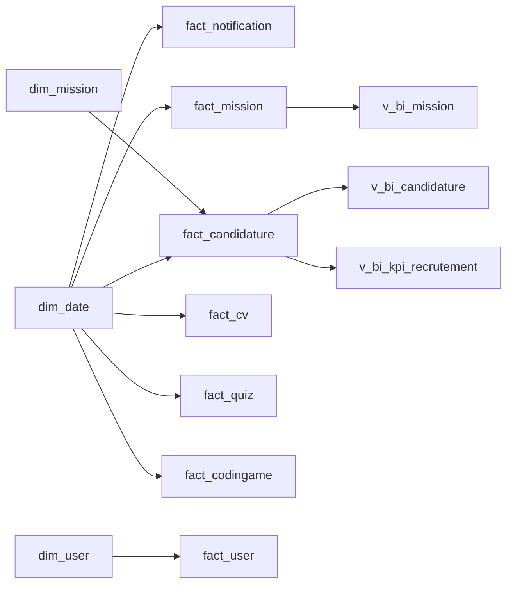

# Find-Me — Tables `findme_dw` et guide des mesures Power BI

Référence pour créer des **mesures DAX**, des visuels et des filtres dans Power BI Desktop.  
Source : entrepôt MySQL `findme_dw` (schéma en étoile Kimball), alimenté par l’ETL Talend.

**Connexion** : `localhost:3306` / base `findme_dw` / `findme_bi` / `findme_bi_readonly`

---

## Vue d’ensemble du modèle



| Type | Tables | Usage Power BI |
|------|--------|----------------|
| **Dimensions** | `dim_date`, `dim_user`, `dim_user_scd2`, `dim_mission`, `dim_skill` | Filtres, axes, libellés |
| **Faits** | `fact_*` | Mesures additives (SUM) |
| **Vues BI** | `v_bi_*` | KPI recrutement / candidatures / missions (déjà jointes) |
| **Gouvernance** | `etl_run_log` | Fraîcheur ETL |

**Relations actives** (projet `FindMe-Dashboard`) : faits → `dim_date` via `date_key` ; `fact_candidature` → `dim_mission` ; `fact_user` → `dim_user`.  
**Pas de relation sur `dim_date[year_num]`** : cette colonne n’est pas unique (plusieurs jours par an). Utilisez `year_num` dans les vues `v_bi_*` pour filtrer par année.

---

## Légende colonnes

| Symbole | Signification |
|---------|----------------|
| 🔑 | Clé / identifiant |
| ∑ | Mesure additive — utiliser `SUM()` en DAX ou agrégation **Somme** |
| ø | Attribut descriptif — ne pas sommer |
| % | Taux / ratio — plutôt `AVERAGE()` ou mesure DAX calculée |

---

## Dimensions

### `dim_date` — Temps (grain : 1 jour)

| Colonne | Type | Agrégation | Description |
|---------|------|------------|-------------|
| `date_key` | Entier | ø 🔑 | Clé `YYYYMMDD` (ex. `20260520`) — **unique**, reliée aux faits |
| `full_date` | Date | ø | Date calendaire |
| `year_num` | Entier | ø | Année (ex. `2026`) — **non unique**, ne pas utiliser en relation |
| `month_num` | Entier | ø | Mois 1–12 |
| `quarter_num` | Entier | ø | Trimestre 1–4 |
| `month_name` | Texte | ø | Libellé mois |
| `day_of_week` | Entier | ø | 1 = lundi … 7 = dimanche |
| `week_of_year` | Entier | ø | Semaine ISO |
| `is_weekend` | Entier | ø | 1 = week-end |

**Mesures DAX exemples**

```dax
Mois sélectionné = SELECTEDVALUE(dim_date[month_name])
Est week-end = SELECTEDVALUE(dim_date[is_weekend]) = 1
```

---

### `dim_user` — Utilisateur (SCD type 1)

| Colonne | Type | Agrégation | Description |
|---------|------|------------|-------------|
| `user_key` | Entier | ø 🔑 | Surrogate key (jointure faits) |
| `user_id` | Entier | ø | ID métier `user_bd.users` |
| `role_name` | Texte | ø | Rôle (candidat, recruteur, …) |
| `status_name` | Texte | ø | Statut compte |
| `country` | Texte | ø | Pays |
| `sexe` | Texte | ø | Genre |

**Mesures DAX exemples**

```dax
Nb utilisateurs (dim) = DISTINCTCOUNT(dim_user[user_key])
Nb par rôle = CALCULATE([Nb utilisateurs (dim)], ALLEXCEPT(dim_user, dim_user[role_name]))
```

---

### `dim_user_scd2` — Historique utilisateur (SCD type 2)

| Colonne | Type | Agrégation | Description |
|---------|------|------------|-------------|
| `user_scd_key` | Entier | ø 🔑 | Version historique |
| `user_id` | Entier | ø | ID utilisateur |
| `role_name` | Texte | ø | Rôle à cette période |
| `status_name` | Texte | ø | Statut à cette période |
| `country` | Texte | ø | Pays à cette période |
| `valid_from` | Date | ø | Début validité |
| `valid_to` | Date | ø | Fin validité (`BLANK` = courant) |
| `is_current` | Entier | ø | 1 = version active |

**Mesure DAX**

```dax
Utilisateurs version courante = CALCULATE(DISTINCTCOUNT(dim_user_scd2[user_id]), dim_user_scd2[is_current] = 1)
```

---

### `dim_mission` — Offre / mission

| Colonne | Type | Agrégation | Description |
|---------|------|------------|-------------|
| `mission_key` | Entier | ø 🔑 | Surrogate key |
| `mission_id` | Entier | ø | ID métier mission |
| `status_mission` | Texte | ø | OPEN, CLOSED, … |
| `type_contrat` | Texte | ø | CDI, CDD, … |
| `is_remote` | Entier | ø | 1 = télétravail |
| `ville` | Texte | ø | Ville |
| `pays` | Texte | ø | Pays |
| `mission_name` | Texte | ø | Titre offre |
| `reference_code` | Texte | ø | Référence interne |

---

### `dim_skill` — Compétences (agrégées CV)

| Colonne | Type | Agrégation | Description |
|---------|------|------------|-------------|
| `skill_key` | Entier | ø 🔑 | Clé compétence |
| `skill_label` | Texte | ø | Nom (Java, Docker, …) |
| `skill_category` | Texte | ø | Langage, Framework, … |
| `usage_count` | Entier | ∑ | Nombre d’occurrences dans les CV |

**Mesures DAX**

```dax
Total usages compétences = SUM(dim_skill[usage_count])
Top compétence = CALCULATE(SELECTEDVALUE(dim_skill[skill_label]), TOPN(1, ALL(dim_skill), [Total usages compétences]))
```

---

## Tables de faits

### `fact_user` — Snapshot utilisateurs actifs

| Colonne | Grain | Agrégation | Description |
|---------|-------|------------|-------------|
| `user_key` | 1 ligne / user | ø 🔑 | Lien `dim_user` |
| `user_count` | | ∑ | Toujours `1` par ligne → **somme = nombre d’utilisateurs** |

```dax
Total utilisateurs = SUM(fact_user[user_count])
```

**Page dashboard** : 03 - Operationnel (carte KPI).

---

### `fact_notification` — Notifications

| Colonne | Grain | Agrégation | Description |
|---------|-------|------------|-------------|
| `notification_key` | 1 notification | ø 🔑 | |
| `date_key` | | ø | → `dim_date` |
| `user_id_degen` | Texte | ø | ID utilisateur dégénéré |
| `is_read` | Entier | ø | 0 = non lu, 1 = lu |
| `notification_count` | | ∑ | Toujours `1` par notification |

```dax
Total notifications = SUM(fact_notification[notification_count])
Notifications lues = CALCULATE([Total notifications], fact_notification[is_read] = 1)
Taux lecture % = DIVIDE([Notifications lues], [Total notifications], 0) * 100
```

**Page dashboard** : 03 - Operationnel.

---

### `fact_mission` — Missions créées

| Colonne | Grain | Agrégation | Description |
|---------|-------|------------|-------------|
| `mission_key` | 1 mission | ø 🔑 | → `dim_mission` |
| `date_key` | | ø | → `dim_date` |
| `publisher_user_id` | Entier | ø | ID publieur |
| `mission_count` | | ∑ | `1` par mission |

```dax
Total missions = SUM(fact_mission[mission_count])
Missions remote = CALCULATE([Total missions], dim_mission[is_remote] = 1)
```

---

### `fact_candidature` — Candidatures (recrutement)

| Colonne | Grain | Agrégation | Description |
|---------|-------|------------|-------------|
| `candidature_key` | 1 candidature | ø 🔑 | |
| `date_key` | | ø | → `dim_date` |
| `mission_key` | | ø | → `dim_mission` |
| `candidat_user_id` | Entier | ø | ID candidat |
| `statut_candidature` | Texte | ø | ACCEPTER, REFUSER, ENCOURS, … |
| `candidature_count` | | ∑ | `1` par candidature |
| `is_accepted` | Entier | ∑ | 1 si acceptée |
| `is_refused` | Entier | ∑ | 1 si refusée |
| `is_en_cours` | Entier | ∑ | 1 si en cours |

```dax
Total candidatures = SUM(fact_candidature[candidature_count])
Candidatures acceptées = SUM(fact_candidature[is_accepted])
Candidatures refusées = SUM(fact_candidature[is_refused])
Taux acceptation % = DIVIDE([Candidatures acceptées], [Total candidatures], 0) * 100
```

**Préférer aussi** la vue `v_bi_kpi_recrutement` pour les KPI mensuels déjà agrégés.

---

### `fact_mission_favori` — Favoris mission

| Colonne | Grain | Agrégation | Description |
|---------|-------|------------|-------------|
| `favori_key` | 1 favori | ø 🔑 | |
| `date_key` | | ø | → `dim_date` |
| `mission_key` | | ø | → `dim_mission` |
| `user_type` | Texte | ø | Type utilisateur |
| `favori_count` | | ∑ | `1` par favori |

```dax
Total favoris = SUM(fact_mission_favori[favori_count])
```

---

### `fact_cv` — CV

| Colonne | Grain | Agrégation | Description |
|---------|-------|------------|-------------|
| `cv_key` | 1 CV | ø 🔑 | |
| `date_key` | | ø | → `dim_date` |
| `user_key` | | ø | Utilisateur (pas de relation active vers `dim_user` dans le PBIP) |
| `cv_count` | | ∑ | `1` par CV |
| `steps_completed` | | ∑ | Étapes formulaire complétées |

```dax
Total CV = SUM(fact_cv[cv_count])
Étapes moyennes = AVERAGE(fact_cv[steps_completed])
```

---

### `fact_quiz` — Quiz

| Colonne | Grain | Agrégation | Description |
|---------|-------|------------|-------------|
| `quiz_key` | 1 tentative | ø 🔑 | |
| `date_key` | | ø | → `dim_date` |
| `user_key` | | ø | |
| `score` | Entier | ∑ | Score obtenu |
| `passed` | Entier | ø | 1 = réussi |
| `attempt_count` | | ∑ | `1` par tentative |

```dax
Tentatives quiz = SUM(fact_quiz[attempt_count])
Score moyen quiz = AVERAGE(fact_quiz[score])
Taux réussite quiz % = DIVIDE(CALCULATE([Tentatives quiz], fact_quiz[passed]=1), [Tentatives quiz], 0) * 100
```

---

### `fact_codingame` — Évaluations techniques

| Colonne | Grain | Agrégation | Description |
|---------|-------|------------|-------------|
| `codingame_key` | 1 session | ø 🔑 | |
| `date_key` | | ø | → `dim_date` |
| `user_key` | | ø | |
| `framework_name` | Texte | ø | Framework / techno |
| `score` | Décimal | ∑ | Score session |
| `total_score` | Décimal | ∑ | Score max possible |
| `session_count` | | ∑ | `1` par session |

```dax
Sessions codingame = SUM(fact_codingame[session_count])
Score moyen = AVERAGE(fact_codingame[score])
```

---

### `etl_run_log` — Journal ETL

| Colonne | Type | Description |
|---------|------|-------------|
| `run_id` | Entier 🔑 | ID exécution |
| `started_at` | Date/heure | Début |
| `finished_at` | Date/heure | Fin |
| `status` | Texte | RUNNING, OK, ERROR |
| `rows_loaded` | Entier ∑ | Lignes chargées |
| `error_message` | Texte | Détail erreur |

```dax
Dernier refresh OK = CALCULATE(MAX(etl_run_log[finished_at]), etl_run_log[status] = "OK")
```

---

## Vues métier (recommandées pour les rapports)

### `v_bi_kpi_recrutement` — KPI recrutement par mois

Grain : **1 ligne par (année, mois)**.

| Colonne | Agrégation | Description |
|---------|------------|-------------|
| `year_num` | ø | Année — **utiliser dans les segments** (page Executive) |
| `month_num` | ø | Mois |
| `candidatures` | ∑ | Total candidatures du mois |
| `acceptees` | ∑ | Acceptées |
| `refusees` | ∑ | Refusées |
| `taux_acceptation_pct` | % | Taux déjà calculé en SQL |

```dax
KPI Candidatures = SUM(v_bi_kpi_recrutement[candidatures])
KPI Acceptées = SUM(v_bi_kpi_recrutement[acceptees])
KPI Taux % = AVERAGE(v_bi_kpi_recrutement[taux_acceptation_pct])
// ou recalcul :
KPI Taux recalculé % = DIVIDE([KPI Acceptées], [KPI Candidatures], 0) * 100
```

**Page dashboard** : 01 - Executive.

---

### `v_bi_candidature` — Candidatures enrichies

Grain : **1 ligne par candidature** (date + mission + statut).

| Colonne | Agrégation | Description |
|---------|------------|-------------|
| `full_date` | ø | Date |
| `year_num`, `month_num`, `month_name` | ø | Temps |
| `mission_name`, `reference_code` | ø | Mission |
| `status_mission`, `type_contrat` | ø | Attributs mission |
| `ville`, `pays` | ø | Localisation |
| `statut_candidature` | ø | Statut |
| `candidature_count` | ∑ | 1 par ligne |
| `is_accepted`, `is_refused`, `is_en_cours` | ∑ | Indicateurs 0/1 |
| `candidat_user_id` | ø | ID candidat |

```dax
Candidatures (vue) = SUM(v_bi_candidature[candidature_count])
Par statut = CALCULATE([Candidatures (vue)], ALLEXCEPT(v_bi_candidature, v_bi_candidature[statut_candidature]))
```

**Page dashboard** : 02 - Managerial. Segment année : `v_bi_candidature[year_num]`.

---

### `v_bi_mission` — Missions enrichies

Grain : **1 ligne par mission créée** (avec date).

| Colonne | Agrégation | Description |
|---------|------------|-------------|
| `full_date`, `year_num`, `month_num` | ø | Temps |
| `mission_name` | ø | Nom mission |
| `status_mission`, `type_contrat` | ø | |
| `is_remote` | ø | Télétravail |
| `ville`, `pays` | ø | |
| `mission_count` | ∑ | 1 par mission |
| `publisher_user_id` | ø | Publieur |

```dax
Missions (vue) = SUM(v_bi_mission[mission_count])
```

**Page dashboard** : 02 - Managerial (graphiques missions / statuts).

---

## Quelle table pour quelle mesure ?

| Besoin métier | Table recommandée | Colonne / mesure |
|---------------|-------------------|------------------|
| Nb utilisateurs inscrits | `fact_user` | `SUM(user_count)` |
| Nb notifications | `fact_notification` | `SUM(notification_count)` |
| Taux lecture notif | `fact_notification` | DAX sur `is_read` |
| Nb missions publiées | `fact_mission` ou `v_bi_mission` | `SUM(mission_count)` |
| Candidatures / acceptation | `v_bi_kpi_recrutement` ou `fact_candidature` | voir ci-dessus |
| CV et complétion | `fact_cv` | `cv_count`, `steps_completed` |
| Compétences populaires | `dim_skill` | `SUM(usage_count)` |
| Filtre par année (Executive) | `v_bi_kpi_recrutement` | `year_num` (segment) |
| Filtre par année (Managerial) | `v_bi_candidature` | `year_num` (segment) |
| Filtre par jour | `dim_date` | `full_date` ou `date_key` via faits |
| Fraîcheur données | `etl_run_log` | `finished_at`, `status` |

---

## Bonnes pratiques DAX (Find-Me)

1. **Mesures plutôt que colonnes calculées** pour les KPI réutilisables.
2. Sur les faits, les colonnes `*_count` valent souvent `1` : `SUM()` = comptage.
3. Pour les **taux**, utiliser `DIVIDE(num, denom, 0)` pour éviter les erreurs de division.
4. Ne pas sommer `year_num` dans `dim_date` — filtrer via `v_bi_*[year_num]`.
5. Vues `v_bi_*` déjà jointes : privilégier pour les graphiques **Executive / Managerial** sans multiplier les relations.
6. Créer les mesures dans **Modélisation** → clic droit sur une table → **Nouvelle mesure**.

---

## Mesures suggérées à créer (checklist PFE)

| Mesure | Table d’accueil | Formule courte |
|--------|-----------------|----------------|
| Total utilisateurs | `fact_user` | `SUM(fact_user[user_count])` |
| Total notifications | `fact_notification` | `SUM(fact_notification[notification_count])` |
| Total candidatures | `v_bi_kpi_recrutement` | `SUM(v_bi_kpi_recrutement[candidatures])` |
| Taux acceptation % | `v_bi_kpi_recrutement` | `DIVIDE(SUM(acceptees), SUM(candidatures), 0) * 100` |
| Total CV | `fact_cv` | `SUM(fact_cv[cv_count])` |
| Missions ouvertes | `v_bi_mission` | `CALCULATE(SUM(mission_count), status_mission = "OPEN")` |

---

## Fichiers liés

| Fichier | Rôle |
|---------|------|
| `bi/dw/schema.sql` | DDL MySQL source |
| `bi/powerbi/FindMe-Dashboard/` | Projet PBIP 3 pages |
| `bi/powerbi/README.md` | Installation et commandes |
| `scripts/generate-powerbi-pbip.ps1` | Colonnes TMDL et relations |

*Document généré pour le projet Find-Me — PFE BIS (Talend + Power BI).*
