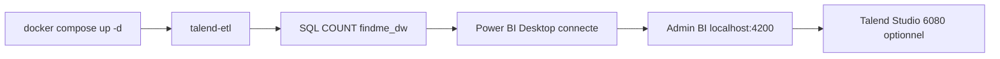

# Checklist — valider Talend + Power BI (sans être expert)

Guide pour **eyarh** (ou tout testeur) : cocher chaque case. Temps total : **45 min à 1 h** la première fois.

**Prérequis :** Docker Desktop démarré, projet à jour (`git pull`), build front OK.

---

## Avant tout (une fois)

```cmd
cd C:\Users\eyarh\Desktop\findMeByEyarhit
git pull
scripts\docker-build-backend.cmd
docker compose build frontend talend-etl bi-hub
docker compose up -d
```

Attendre que MySQL soit prêt (1–2 min), puis :

```cmd
docker compose run --rm talend-etl
```

| OK si… | Case |
|--------|------|
| La commande se termine **sans erreur** | ☐ |
| Vous voyez dans les logs : **`ETL terminé avec succès`** (ou `SUCCESS`) | ☐ |

Si erreur → voir `docs/GUIDE_AMI_DOCKER.md` section dépannage ETL.

---

## Partie 1 — Talend (ETL) — le minimum à valider

**Ce que c’est :** Talend **alimente** la base analytique `findme_dw` à partir des bases de l’app (users, missions, CV…).

### 1.1 Validation facile (ligne de commande — suffit pour dire « Talend marche »)

```cmd
docker compose run --rm talend-etl
```

| OK si… | Case |
|--------|------|
| Logs : `ETL terminé avec succès` | ☐ |
| Pas de `exit code 1` | ☐ |

### 1.2 Vérifier que les données sont dans l’entrepôt (preuve concrète)

```cmd
docker compose exec mysql mysql -ufindme_bi -pfindme_bi_readonly -e "SELECT COUNT(*) AS lignes FROM findme_dw.fact_candidature; SELECT COUNT(*) AS dates FROM findme_dw.dim_date;"
```

| OK si… | Case |
|--------|------|
| Les deux commandes affichent un **nombre > 0** (ou au moins pas d’erreur SQL) | ☐ |

**Capture écran à garder pour le jury :** fenêtre CMD avec `ETL terminé avec succès` + résultat des `COUNT(*)`.

### 1.3 Talend Open Studio (interface graphique) — **optionnel**

Utile pour la **démo visuelle** du job Talend, pas obligatoire si l’ETL CLI fonctionne.

1. Télécharger l’installateur (lien depuis le site Talend après compte gratuit) :
   ```cmd
   scripts\download-talend.cmd "https://VOTRE-LIEN-TALEND.tar.xz"
   ```
2. Build + démarrage (long la 1ère fois, ~1 Go) :
   ```cmd
   docker compose --profile talend-ui build talend-studio
   docker compose --profile talend-ui up -d talend-studio
   ```
3. Navigateur : http://localhost:6080 — mot de passe : **`findme`**

| OK si… | Case |
|--------|------|
| Le bureau Linux s’affiche dans le navigateur | ☐ |
| Dossier / projet **FindMe_Load_DW** visible (documentation du job) | ☐ |

---

## Partie 2 — Power BI (OLAP) — le minimum à valider

**Ce que c’est :** Power BI **lit** `findme_dw` pour graphiques, filtres, drill-down (analyse du cours).

> Sur Docker **Linux** (cas normal), Power BI **Report Server** dans Docker **ne tourne pas** en même temps que MySQL.  
> **Solution formation : Power BI Desktop sur Windows** (installé par `bi-start.cmd` via winget, ou [téléchargement Microsoft](https://www.microsoft.com/power-platform/products/power-bi/desktop)).

### 2.1 Installer Power BI Desktop (si pas déjà fait)

- Menu Démarrer → chercher **Power BI Desktop**
- Ou : `winget install -e --id Microsoft.PowerBIDesktop`

| OK si… | Case |
|--------|------|
| L’application Power BI Desktop s’ouvre | ☐ |

### 2.2 Se connecter à l’entrepôt Find-Me

1. Power BI Desktop → **Obtenir des données** → **Base de données** → **MySQL**
2. Renseigner :

| Champ | Valeur |
|-------|--------|
| Serveur | `localhost:3306` |
| Base | `findme_dw` |
| Utilisateur | `findme_bi` |
| Mot de passe | `findme_bi_readonly` |

3. Cocher les tables : au minimum `dim_date`, `dim_mission`, `fact_candidature`, `v_bi_candidature`
4. **Charger** (mode Import)

| OK si… | Case |
|--------|------|
| La connexion **réussit** (pas « Unable to connect ») | ☐ |
| Les tables apparaissent à droite (champs visibles) | ☐ |

**Test rapide si Power BI échoue :**

```cmd
docker compose ps
```

`findme-mysql` doit être **healthy**. Puis retester la commande SQL de la partie 1.2.

### 2.3 Preuve OLAP minimale (5 minutes, sans être expert DAX)

1. Vue **Données** : vérifier que `fact_candidature` a des lignes
2. Vue **Rapport** : glisser un champ numérique sur **Visuel en carte** (ex. nombre de candidatures)
3. Glisser `dim_date` ou un statut en **filtre** et changer le filtre → le chiffre change

| OK si… | Case |
|--------|------|
| Au moins **un graphique ou une carte** affiche un nombre | ☐ |
| Un **filtre** modifie l’affichage (drill / slice simple) | ☐ |

**Capture écran jury :** Power BI avec connexion `findme_dw` + un visuel + filtre.

> Les fichiers `.pbix` (Executive / Managérial / Opérationnel) se créent dans Power BI puis se copient dans `bi/powerbi/reports/`. Le repo contient le **guide** : `bi/powerbi/README.md`.

---

## Partie 3 — Valider dans l’application (admin BI)

1. Créer un compte admin (une fois) — remplacer l’email :

```cmd
docker exec findme-mysql mysql -uroot -proot user_bd -e "INSERT INTO roles (role) SELECT 'ADMIN' WHERE NOT EXISTS (SELECT 1 FROM roles WHERE role='ADMIN'); UPDATE users SET role_id=(SELECT role_id FROM roles WHERE role='ADMIN' LIMIT 1) WHERE email='VOTRE_EMAIL@example.com';"
```

2. http://localhost:4200 → connexion → menu **Tableaux de bord BI**

| OK si… | Case |
|--------|------|
| La page **Business Intelligence Find-Me** s’affiche | ☐ |
| Badge hub : **connecté** ou équivalent (pas erreur rouge permanente) | ☐ |
| Boutons **Talend**, **Hub BI**, détails ETL visibles | ☐ |
| Liste des **3 rapports Power BI** (Executive, Managérial, Opérationnel) ou message clair si `.pbix` pas encore créés | ☐ |

3. Hub BI : http://localhost:3032

| OK si… | Case |
|--------|------|
| Page hub s’ouvre | ☐ |
| Action type **Lancer ETL** / statut DW visible | ☐ |

---

## Résumé « quoi dire au jury » (30 secondes)

1. **Talend** : « L’ETL extrait les 5 bases OLTP, transforme et charge le schéma en étoile `findme_dw` — preuve : log SUCCESS + `docker compose run --rm talend-etl`. »
2. **Power BI** : « Connexion OLAP sur `findme_dw`, mesures et filtres sur les faits candidatures/missions — preuve : capture Desktop + admin BI. »
3. **Docker** : « Chaîne reproductible : MySQL + `talend-etl` + front admin. »

---

## Ordre recommandé le jour J



---

## Aide rapide

| Problème | Doc |
|----------|-----|
| Docker / build / ETL | `docs/GUIDE_AMI_DOCKER.md` |
| Talend Studio Docker | `bi/talend/studio-docker/README.md` |
| Power BI connexion | `bi/powerbi/README.md` |
| Soutenance PFE | `docs/BI_PFE_TALEND_POWERBI.md` |

**Une commande tout-en-un :** `scripts\bi-start.cmd` (sans Talend Studio lourd par défaut ; ajouter `-WithTalendStudio` si besoin).
