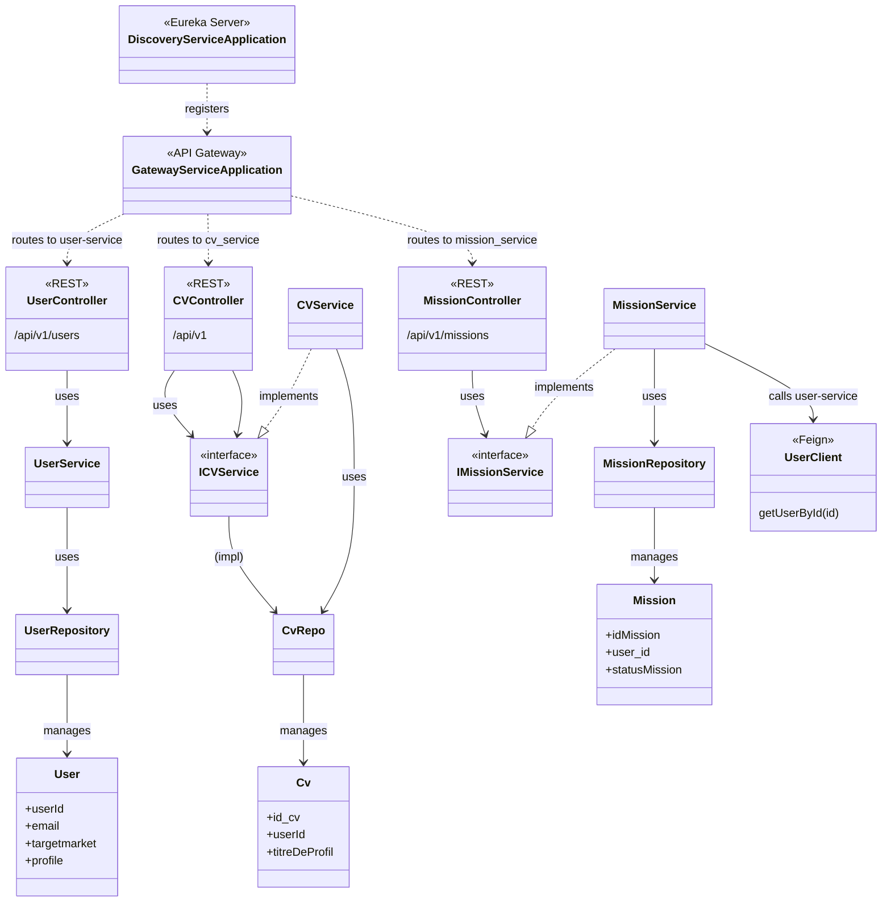
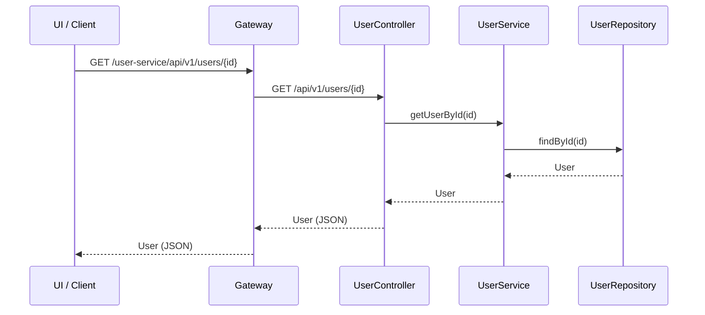
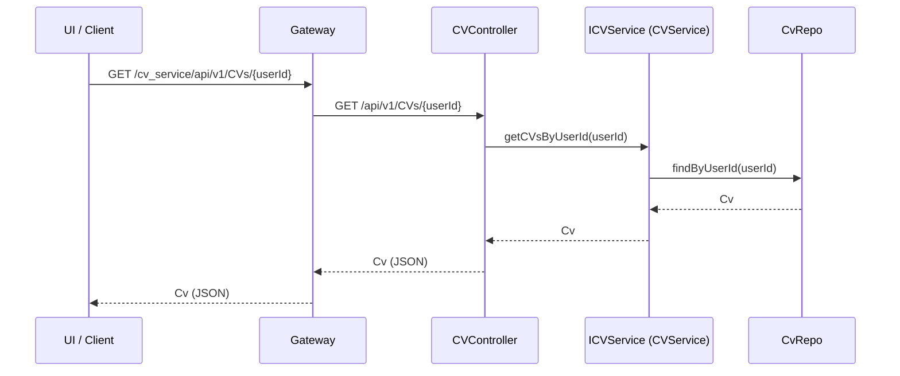
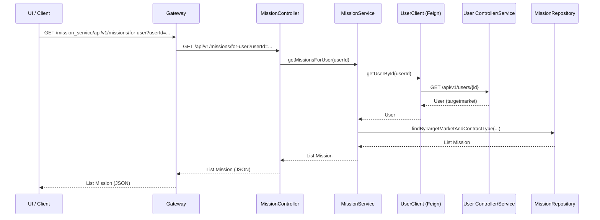
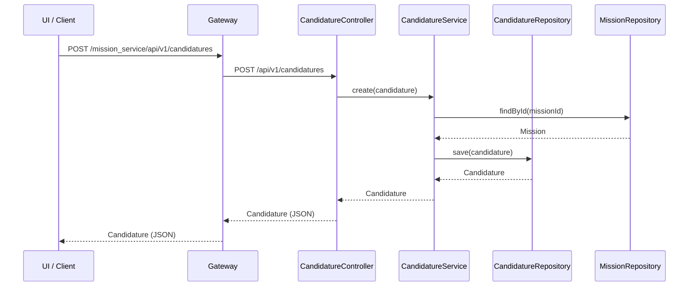
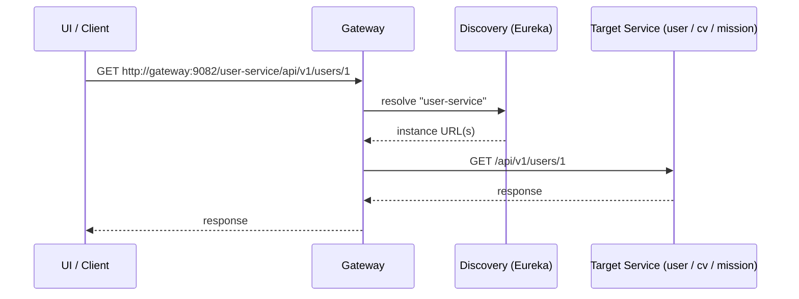

# Backend – Class & Sequence Diagrams (CV, Mission, User, Discovery, Gateway)

**Scope:** CV, Mission, User, Discovery, Gateway (CodingGame & Quiz excluded).

---

## 1. Class diagram (simplified)

High-level view: **Discovery**, **Gateway**, and the three domain services with their layers (Controller → Service interface/impl → Repository or Feign).

**Summary:**

| Layer        | User        | CV                    | Mission                 |
|-------------|-------------|------------------------|-------------------------|
| **Entry**   | Gateway     | Gateway                | Gateway                 |
| **Controller** | UserController | CVController (+ Education, Experience, Langue, Competence) | MissionController, CandidatureController, MissionFavoriController |
| **Service** | UserService | ICVService / CVService | IMissionService / MissionService |
| **Persistence / External** | UserRepository | CvRepo (+ EducationRepo, etc.) | MissionRepository, **UserClient** (Feign → user-service) |

---

## 2. Sequence diagrams (clear & logical)

All flows: **UI (client) → Gateway → Controller → Service → Repository or Feign**. Discovery is used by Gateway to resolve service URLs (not shown in every diagram for simplicity).

---

### 2.1 Get user by ID (e.g. used by Mission service via Feign)

**Actor:** Client (or Mission_service via Feign). **Path:** `GET /api/v1/users/{id}`.

---

### 2.2 Get or create CV by user (CV domain)

**Actor:** UI. **Path:** `GET /api/v1/CVs/{userId}` or `POST /api/v1/save`.

---

### 2.3 Get missions for user (filtered by target market) – cross-service

**Actor:** UI. **Flow:** Mission service calls User service to get `targetmarket`, then filters missions.

---

### 2.4 Create candidature (Mission domain)

**Actor:** UI. **Path:** `POST /api/v1/candidatures`.

---

### 2.5 Gateway routing (with Discovery)

**How** the UI reaches any service: Gateway uses Discovery (Eureka) to resolve the service-id from the URL to an instance.

---

## 3. Layer summary (for sequence)

| Layer        | Role |
|-------------|------|
| **UI**      | Frontend or external client (e.g. Angular). |
| **Gateway** | Single entry (port 9082). Path = `/<service-id>/...` → routes to that service. |
| **Controller** | REST endpoint; receives HTTP, delegates to service, returns response. |
| **Service** | Business logic; uses Repository and/or Feign client. |
| **Repository** | Database access (JPA). |
| **Feign (UserClient)** | HTTP client to `user-service`; used by Mission_service to get user's `targetmarket`. |

---

**Files reference:** See `BACKEND_DOMAINS_SUMMARY.md` at project root for detailed class paths and flows.
